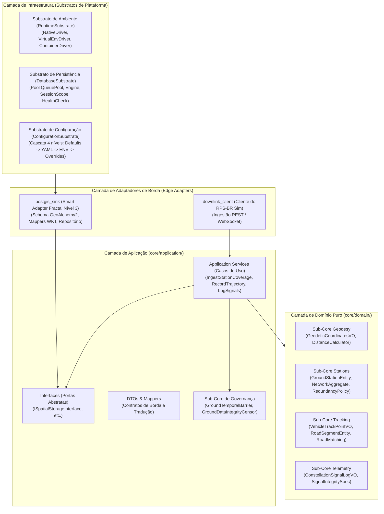

# 🏛️ Visão Geral da Arquitetura & O Hexágono Dourado

Especificação arquitetural do **Segmento de Solo do RPS-BR (`brazilian-rps-ground`)**, fundamentada no paradigma do **Hexágono Dourado** (*Clean Fractal Hexagonal Architecture*).

---

## 🎯 1. Princípios da Clean Fractal Hexagonal Architecture

O sistema de solo foi concebido sob quatro postulados invioláveis:

1. **Pureza Absoluta do Domínio:** O núcleo de domínio (`core/domain/`) desconhece bancos de dados, frameworks de rede ou bibliotecas externas. Contém apenas tipos primitivos, funções matemáticas puras e Value Objects imutáveis.
2. **Dependência Concêntrica Unidirecional:** O fluxo de acoplamento aponta sempre para o centro ($\text{Domínio} \leftarrow \text{Aplicação} \leftarrow \text{Adaptadores/Infraestrutura}$).
3. **Os 12 Elementos Canônicos:** Estrutura formal rígida composta por 4 elementos na Camada de Aplicação e 8 elementos táticos DDD na Camada de Domínio.
4. **Governança Unificada:** O **Sub-Core de Governança** é o único sub-core de aplicação, assegurando conformidade com contratos, barreiras temporais (IEEE 1516) e isolamento de integridade.

---

## 🧭 2. Topologia Concêntrica do Solo

