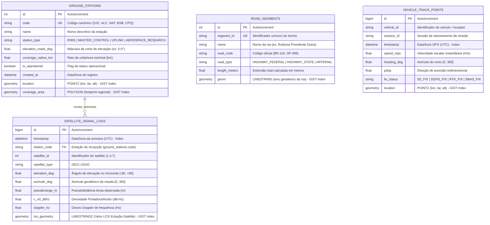

# 💾 Modelo de Dados Espacial & Schema PostGIS (US124)

Especificação do modelo relacional e espacial implementado no PostgreSQL com extensão PostGIS (SRID 4326 - WGS84 / SIRGAS2000), concebido para armazenar grandes volumes de trajetórias, telemetrias de constelação e malhas viárias.

---

## 🗺️ 1. Diagram-as-Code: Diagrama Entidade-Relacionamento (ER)



---

## 🏛️ 2. Índices Espaciais e Performance de Consulta

Todas as colunas geométricas utilizam **Índices Espaciais GIST (Generalized Search Tree)** baseados em R-Tree no PostGIS:

1. **`ground_stations.location` & `coverage_area`:**
   * Permite consultas de contenção espacial instantâneas:
     ```sql
     SELECT code, name FROM ground_stations
     WHERE is_operational = TRUE 
       AND ST_Contains(coverage_area, ST_SetSRID(ST_MakePoint(:lon, :lat), 4326));
     ```
2. **`road_segments.geom`:**
   * Permite consultas de proximidade viária (Map Matching) com cálculo geodésico no esferóide em metros:
     ```sql
     SELECT road_code, name FROM road_segments
     WHERE ST_DWithin(
         geom::geography, 
         ST_SetSRID(ST_MakePoint(:lon, :lat), 4326)::geography, 
         :distance_meters
     );
     ```
3. **`vehicle_track_points.location`:**
   * Suporta filtragem por bounding box geográfico de alta velocidade:
     ```sql
     SELECT * FROM vehicle_track_points
     WHERE ST_Within(location, ST_MakeEnvelope(:min_lon, :min_lat, :max_lon, :max_lat, 4326));
     ```

---

## ⚡ 3. Atendimento aos Requisitos da US124

| Requisito US124 | Implementação no Schema | Validação |
| :--- | :--- | :--- |
| **Persistir Trajetórias** | Tabela `vehicle_track_points` com geometria `POINTZ`, timestamps indexados e métricas de qualidade (PDOP). | `ITrajectoryStorageInterface` |
| **Persistir Malhas Viárias** | Tabela `road_segments` com geometria `LINESTRING` e codificação oficial (BR-116 Dutra, SP-099 Tamoios). | `IRoadNetworkStorageInterface` |
| **Persistir Cobertura Regional** | Tabela `ground_stations` com polígonos `coverage_area` das 5 estações canônicas (SJC, ALC, NAT, BSB, CPQ). | `IGroundStationStorageInterface` |
| **Persistir Telemetria de Sinais** | Tabela `satellite_signal_logs` com integridade referencial com as estações e vetores de visada `LINESTRINGZ`. | `ISignalLogStorageInterface` |
