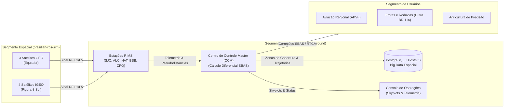

# 🛰️ Brazilian RPS Ground Segment (`brazilian-rps-ground`)

Bem-vindo ao portal de documentação e engenharia do **Brazilian Regional Positioning System — Ground Segment (SPR-BR / SBAS-BR)**.

---

## 🎯 1. Visão Geral da Missão

O **`brazilian-rps-ground`** constitui o **Segmento Terrestre e de Usuários** do Sistema de Posicionamento Regional Brasileiro, concebido como o complemento simétrico e coordenado ao simulador do segmento espacial ([`brazilian-rps-sim`](https://github.com/Rj-mwe/brazilian-rps-sim)).

---

## 🏛️ 2. Fundamentos de Engenharia

O projeto foi edificado sob as seguintes diretrizes de arquitetura e rigor aeroespacial:

1. **O Hexágono Dourado (*Clean Fractal Hexagonal Architecture*):**
   * Núcleo puro de domínio totalmente isolado de bancos, redes ou bibliotecas externas.
   * Regulação formal dos **12 Elementos Canônicos** (4 em Application e 8 em Domain).
   * **Sub-Core de Governança** como o único sub-core de aplicação, garantindo barreiras temporais estritas (**IEEE 1516**) e quarentena de integridade de dados.
2. **Big Data Espacial com PostGIS (US124):**
   * Persistência espacial nativa em coordenadas geodésicas de alta precisão (SIRGAS2000 / WGS84 - SRID 4326).
   * Rastreamento de trajetórias veiculares, malha viária do Vale do Paraíba (BR-116, SP-099) e zonas de cobertura regional das estações de monitoramento.
3. **Substratos Técnicos de Plataforma:**
   * Isolamento de persistência, ambientes de execução e configuração em cascata.
4. **Tríade de Garantia Contínua (*Assurance Triad*):**
   * **Tests:** Testes unitários de portas e lógica de negócio e testes de integração com banco de dados.
   * **Evals:** Avaliações de latência e throughput de Big Data espacial (> 35.000 registros/s).
   * **Audits:** Linters arquiteturais AST verificando automaticamente a não-violação de fronteiras.

---

## 👨‍🏫 3. Contexto Acadêmico

* **Instituição:** Instituto Tecnológico de Aeronáutica — ITA.
* **Programa:** Pós-Graduação em Engenharia Aeronáutica e Mecânica / Computação.
* **Disciplinas:** CE-230, CE-235 e CE-237 (Prof. Dr. Adilson Marques da Cunha e Prof. Dr. Luiz Alberto Vieira Dias).
* **Alocação na Turma:** **TS#2 (Segmento de Solo / Usuários)**.
